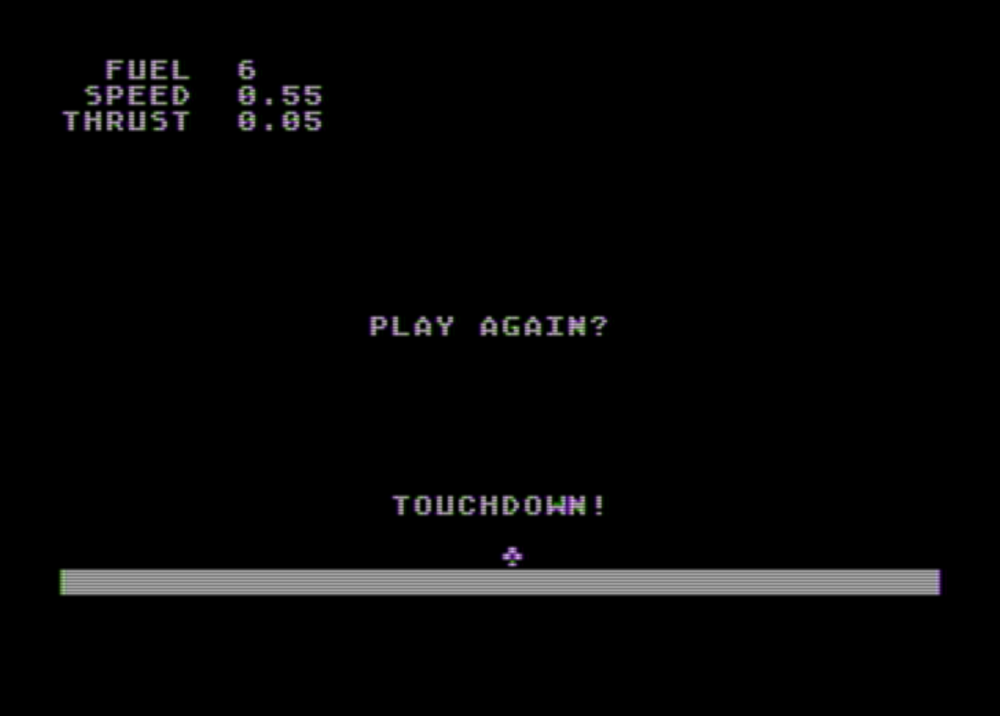

# SpaceLander
Atari Port of C64 Space Lander from COMPUTE'S! GAZETTE magazine Issue 5

---

| **Space Lander -- Version 00 - Port from C64 to Atari** |
| ------- |
|  | 

---

Space Lander is originally a C64 program by Chris Garret and published by COMPUTE!'s Gazette magazine in Issue 5, November 2025.

This is a simple port to the Atari written and tested in Altirra using Atari BASIC.

- Fairly direct port using the same graphics characters the C64 version uses for the Lander and the flame.
- Cursor movements have been replaced with Atari BASIC's POSITION statements.
- Joystick input has been implemented to replace the keyboard for the game play. The prompts to restart the game and choose difficulty level still use the keyboard.
- Since Atari BASIC supports longer, meaningful variable names, the variables have been updated for better readability.

---

The files:

* ATA_LNDR.BAS --- Atari BASIC tokenized SAVE'd file.

* ATA_LNDR.LIS --- ATARI BASIC LIST'd text file. (Atari End Of Line format/CHR$(155))

* ATA_LNDR.LTX--- ATARI BASIC LIST'd text file with PC End Of Lines instead of Atari CHR$(155). Useful for editing outside of the Atari and then ENTERing it back in from an emulator's Host drive (such as the Altirra emulator.)

---
